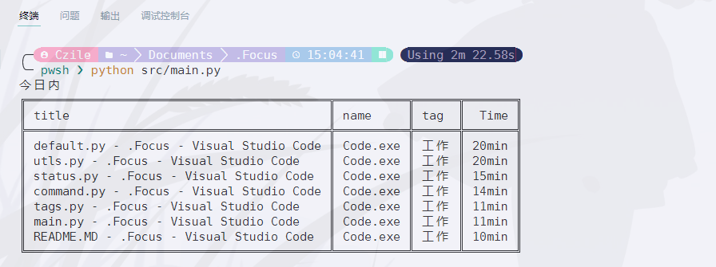

# FocusRecorder

一个用来记录电脑使用时间的应用，基于 SQLITE3，支持自定义查询和数据管理，支持跨设备使用。

## 功能

FocusRecorder 可以记录你的电脑使用情况，相比于其他同类型产品，它可以：
- [x] **支持跨设备使用**，通过磁盘映射器，将数据库放置于云端空间，可以同步你在每个设备的使用记录
- [x] **支持自定义查询**，通过使用 SQL 语句，你可以随心所欲地从原始数据中获取任何你想得到的信息，而不必受制于其他产品给出的模板
- [x] **方便的标签管理**，你可以非常轻松地通过 SQL 语句，管理标签内容。例如，你可以轻松地将标题中含有 *泛函* 两个字的页面归为 *学习* 类别，同样地，可以将 *vscode* 的任何子界面归为 *工作* 类别，**通过 `--tag` 参数，可以轻松得到今天每个类别的使用时间**
- [x] **自适应空间管理**，你可以通过设置轻松管理数据库空间使用，例如，你可以让数据库只保留最近的30天的数据。

**对于初学者，我们后续有计划完善查询的 SQL 教程**



## 用法
```
usage: main.py [-h] [--user USER] [--tags] [--status] [--command] [--record]
               [--setting]

记录电脑使用时间

optional arguments:
  -h, --help            show this help message and exit
  --user USER, -u USER  使用指定用户登录
  --tags, -t            按标签查看使用量
  --status, -s          查看数据库状态
  --command, -c         使用sql语言管理和自定义查询
  --record, -r          记录一次正在使用的窗口
  --setting             设置默认参数
```

## 开始使用
请遵照下列步骤开始使用此应用：
1. 下载 `python3`，并将其加入环境变量，这一步网上有许多教程，此处不再展开。
2. 下载此应用的源代码，解压，并打开命令行，切换到解压后的目录。
3. 安装所需依赖，即在命令行中运行
```bash
pip install -r requirements.txt
```
4. **启动自动记录服务**，该服务是用来记录电脑使用情况的脚本。修改 `autoRecord.vbs` 中对应 `main.py` 的位置，然后打开 `Windows 任务计划程序`，点击右侧的创建任务，并设置好各项参数。如果你不知道各项参数应该设置什么，请参照下面的表格：

|类别|Key|Values|
|-|-|-|
|常规|名称|FocusRecorder|
|触发器|按预定计划|每天04：00：00，每隔一天执行一次|
|触发器|重复时间间隔|1分钟，一天|
|操作|启动程序|`autoRecord.vbs`，起源于对应目录|
|条件|只有计算机使用交流电源才启用此服务|不勾选|
|条件|唤醒计算机运行此服务|勾选|
|设置|如果过了计划时间，立即启动服务|勾选|

5. 查看电脑使用情况
服务启用一段时间后，可以通过命令查看电脑使用情况：
```bash
python src/main.py
```

**对于进阶使用者，包括跨设备使用等情况，我们的进阶教程仍在编写中。**

## 参与贡献
可以提交 issue/PR 来参与贡献，如果使用的人数多，我会考虑建个小群。在 LICENSE 的限制下可以自由修改和使用本软件。